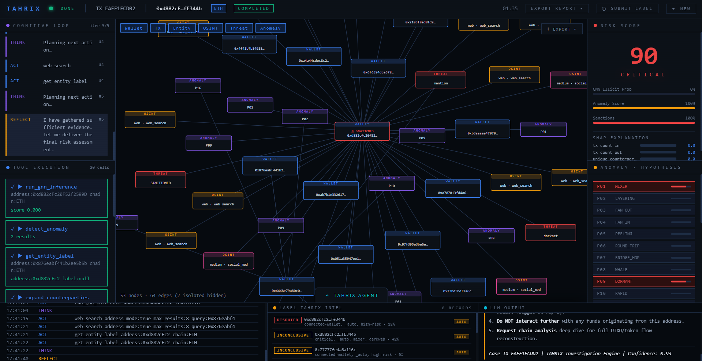
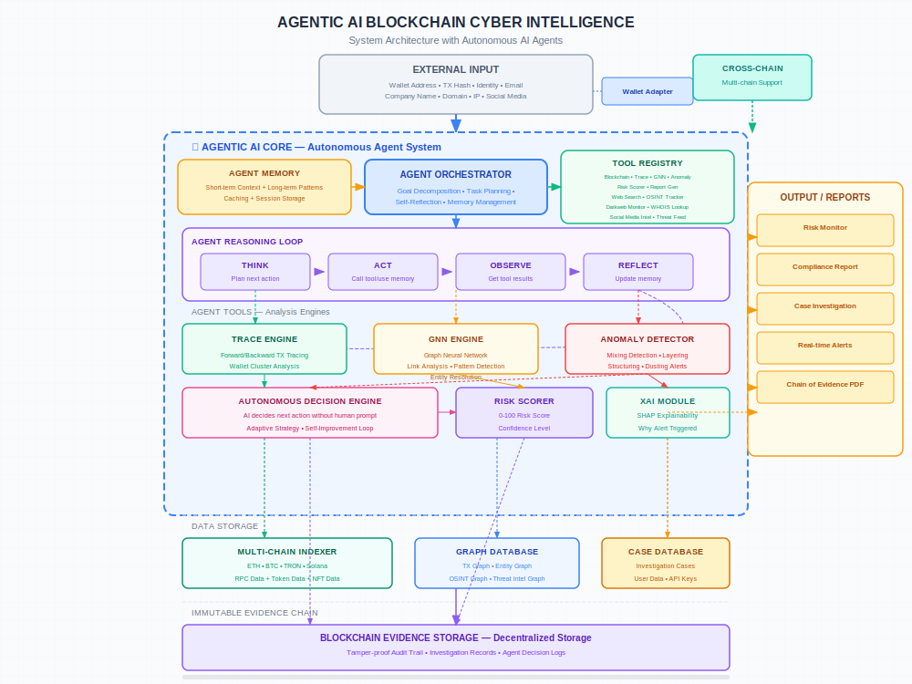
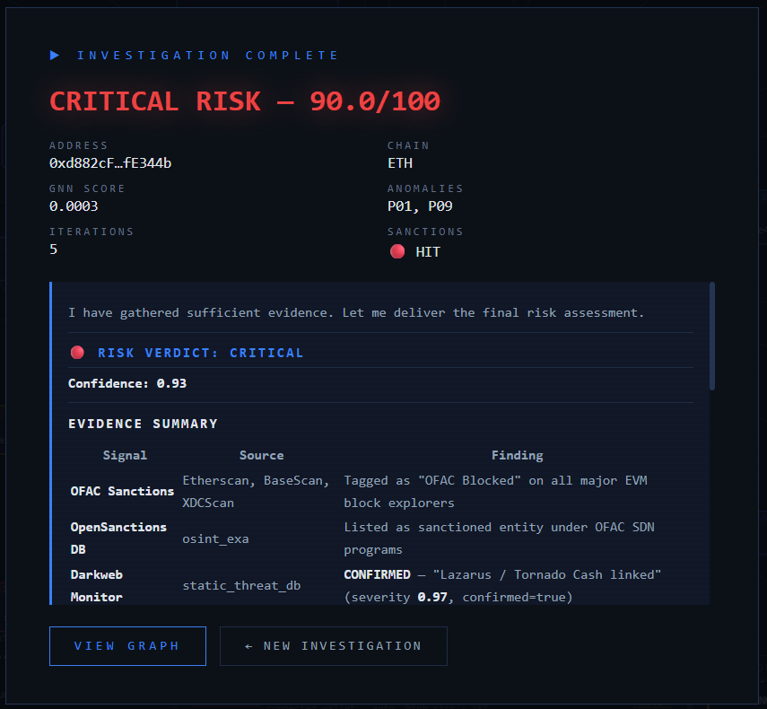

<table align="center">
<tr><td align="center">


---

### Agentic AI Blockchain Cyber Intelligence Platform

[]()
[]()
[]()
[]()

> **TAHRIX** is an autonomous blockchain investigation platform that combines agentic AI, graph neural networks, and multi-chain analysis to detect and investigate cryptocurrency-based crime.

</td></tr>
</table>

<p align="center">
  
</p>

## Overview

TAHRIX empowers security analysts and compliance teams to investigate cryptocurrency wallets and transactions using AI-driven automation. The platform autonomously formulates hypotheses, executes investigations across multiple blockchains, and generates risk assessment reports.

### Key Features

| Feature | Description |
|---------|-------------|
| **Agentic AI Investigation** | Autonomous AI agent that conducts end-to-end investigations without manual intervention |
| **Multi-Chain Support** | Unified analysis across Ethereum, Solana, Base, Polygon, and BNB Chain |
| **Graph Neural Network** | ONNX-based GNN model for detecting illicit transaction patterns |
| **Real-time OSINT** | Integrated web and social media intelligence gathering |
| **Sanctions Screening** | OFAC and compliance database checks |
| **Risk Scoring** | Multi-factor risk assessment with GNN, anomaly detection, and centrality metrics |

## Architecture



## Tech Stack

| Layer | Technology |
|-------|------------|
| **API** | FastAPI, Pydantic, SQLAlchemy |
| **Workers** | Celery, asyncio |
| **Database** | PostgreSQL, Neo4j |
| **Cache/Queue** | Redis |
| **AI/ML** | OpenAI SDK, ONNX Runtime, GNN (GAT) |
| **Search** | Exa AI, DuckDuckGo |
| **Frontend** | Vanilla JS, D3.js |

## Quick Start

### Prerequisites

- Docker & Docker Compose
- PostgreSQL, Neo4j, Redis (via Docker)
- API Keys: Alchemy, Helius, Etherscan, Exa AI, OpenCode Zen

### Installation

```bash
# Clone the repository
git clone https://github.com/fikriaf/TAHRIX.git
cd TAHRIX/backend

# Copy environment template
cp .env.example .env

# Edit .env with your API keys
# Required: LLM_API_KEY, ALCHEMY_API_KEY, NEO4J_PASSWORD, etc.

# Start all services
docker compose up --build
```

### Access

| Service | URL |
|---------|-----|
| API Documentation | `http://localhost:8000/docs` |
| Frontend | `http://localhost:8000` (or configured public URL) |

## Configuration

Key environment variables in `.env`:

| Variable | Description | Required |
|----------|-------------|----------|
| `LLM_API_KEY` | OpenCode Zen API key | Yes |
| `LLM_BASE_URL` | LLM endpoint | Yes |
| `LLM_MODEL` | Model name (e.g., `minimax-m2.5-free`) | Yes |
| `ALCHEMY_API_KEY` | Ethereum/Polygon data | Yes |
| `HELIUS_API_KEY` | Solana data | Yes |
| `NEO4J_PASSWORD` | Neo4j database password | Yes |
| `EXA_API_KEY` | Web search for OSINT | No |

## API Endpoints

### Investigation Cases

```http
POST /api/v1/cases          # Start new investigation
GET  /api/v1/cases          # List all cases
GET  /api/v1/cases/{id}     # Get case details
GET  /api/v1/cases/{id}/events    # Stream investigation events (SSE)
GET  /api/v1/cases/{id}/graph     # Get wallet graph
POST /api/v1/cases/{id}/report    # Generate PDF report
```

### Tahrix Agent

```http
POST /api/v1/agent/chat     # Chat with AI agent
```

### Address Resolution

```http
POST /api/v1/resolve        # Resolve blockchain addresses
GET  /api/v1/labels         # Get intel labels
```

## Demo

<p align="center">
  
</p>

The platform provides:
- Real-time investigation progress via Server-Sent Events
- Interactive wallet relationship graph visualization
- Multi-factor risk scoring with GNN confidence
- Comprehensive event logs and audit trail
- PDF report generation for compliance

## Project Structure

```
TAHRIX/
├── backend/                 # Python FastAPI application
│   ├── app/
│   │   ├── core/           # Configuration, logging, exceptions
│   │   ├── db/             # Database clients (Postgres, Neo4j, Redis)
│   │   ├── models/         # SQLAlchemy + Pydantic schemas
│   │   ├── repositories/ # Data access layer
│   │   ├── adapters/      # External API clients
│   │   ├── services/       # Domain services (risk, GNN, anomaly)
│   │   ├── agent/          # Agentic AI orchestrator + tools + memory
│   │   ├── api/v1/        # REST endpoints
│   │   └── workers/       # Celery tasks
│   ├── ml/                 # GNN training + ONNX export
│   └── tests/              # Test suite
├── frontend/               # Single-page application
│   └── index.html          # Dashboard UI
├── demo/                   # Demo screenshots
└── agentic_ai_architecture.svg  # System architecture diagram
```

## Deployment

TAHRIX is deployed on a cloud server with Docker.

| Service | Endpoint |
|---------|----------|
| API | `https://tahrix.serveousercontent.com` |
| Public Access | Via reverse proxy (Traefik/Caddy) |

### Production Considerations

- Use PostgreSQL with connection pooling
- Enable Neo4j causal clustering for graph storage
- Configure Celery with dedicated worker pool
- Set up monitoring (Prometheus, Grafana)
- Enable TLS/HTTPS for all external connections

## License

This project is licensed under the MIT License.

## Author

**Fikri Armia Fahmi**  
Blockchain Fundamentals  
Universitas Pembangunan Jaya